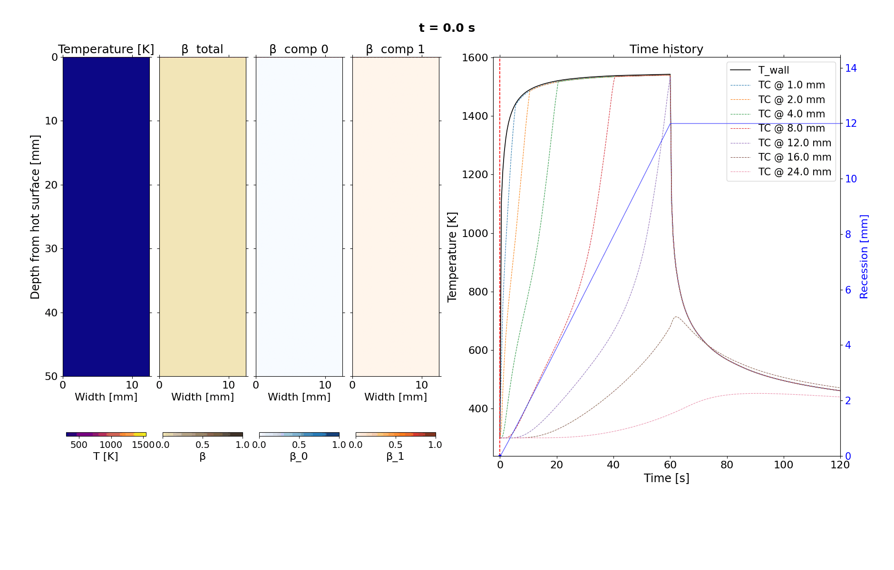
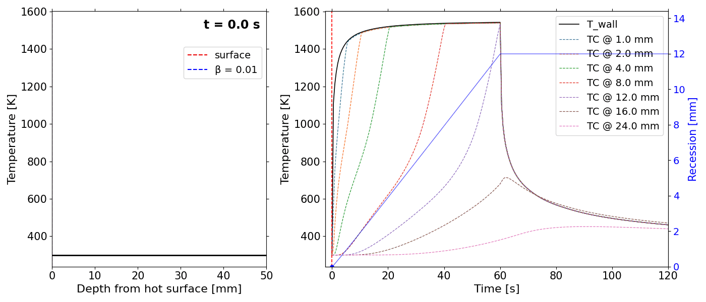

<!-- SPDX-License-Identifier: MIT -->
# SCAM —  <span style="font-size: 65%;"> (not so)</span> Simple Code for Ablative Materials

A 1-D charring ablation solver for spacecraft thermal protection systems, implemented in pure Python.

SCAM models the coupled thermal and chemical response of ablative heat shields (carbon-phenolic composites, felt insulation, etc.) under aerothermal heating — the same physics that governs re-entry vehicle survivability. It is verified against the [PATO](https://pato.ac) reference solver's `AblationTestCase` benchmark suite.

---

## Physics

SCAM solves a coupled system each timestep using the CMA (Charring Material Ablation) algorithm:

1. **Decomposition** — Arrhenius pyrolysis kinetics integrated analytically on a nodelet subgrid
2. **Pyrolysis gas flux** — mass flux from `−dρ/dt`, convected outward through the porous char
3. **In-depth energy** — 1-D FVM heat equation (Backward Euler), assembled into a tridiagonal system
4. **Surface energy balance (SEB)** — Newton iteration on `T_wall` coupling convection, radiation, char oxidation, pyrolysis gas blowing, and conduction into the solid
5. **Surface recession** — char surface mass balance; mesh updated by Lagrangian node-drop or ALE continuous remap

Optional physics: element transport (Z_elem PDE), Darcy/pressure-driven gas flow, live equilibrium surface chemistry via Cantera.

---

## Visualization

TACOT 3.0 ablation test case (5 cm slab, 60 s arc-jet heating + 60 s cooldown):

**Slab view** — temperature, total char fraction β, and per-component decomposition fronts (resin_A and resin_B) as 2-D colored contours. Light gray = ablated zone. Red dashed line = receding surface.



**Profile view** — temperature profile sweeping through the material over time. Red dashed = surface, blue dashed = β = 0.5 pyrolysis front.



Generated with:
```bash
python3 -m scam examples/templates/ablation2_template.yaml
python3 examples/templates/plot_results.py results/ablation2_template/ --slab --speed 30
python3 examples/templates/plot_results.py results/ablation2_template/ --video --speed 30
```

---

## Installation

Requires Python 3.10+.

```bash
git clone <repo>
cd SCAM
pip install -e ".[dev]"
```

For HDF5 output:
```bash
pip install -e ".[hdf5]"
```

For live Cantera surface chemistry:
```bash
pip install -e ".[bprime]"
```

---

## Quick Start

**Run the included TACOT arcjet benchmark via YAML input deck:**

```bash
python3 -m scam examples/other_examples/tacot_arcjet.yaml
```

**Or drive it from Python:**

```bash
MPLBACKEND=Agg python3 examples/other_examples/full_ablation_tacot.py
```

**Run all tests:**

```bash
pytest tests/ -q
```

---

## Input Format

Cases are defined in YAML. A minimal flat-plate example:

```yaml
name: "My Case"

geometry:
  type: slab

stack:
  layers:
    - material: TACOT
      thickness: 0.05   # metres
      n_nodes: 51
      n_subcells: 4

surface_bc:
  type: energy_balance
  alpha_conv: 5000.0    # W/m²/K
  T_aw: 8000.0          # K
  emissivity: 0.85
  rho_e_u_e: 0.1        # kg/m²/s  (edge mass flux for blowing)
  p_e: 10000.0          # Pa

back_bc:
  type: adiabatic

solver:
  t_end: 120.0
  dt_max: 0.5
```

Boundary condition parameters also accept Python callables for time-varying inputs (see `examples/verification/ablation1/compare_pato_ablation1_function.py`).

---

## Material Library

> **DISCLAIMER — UNVERIFIED MATERIAL DATA**
>
> The material property cards in `scam/materials/` are compiled from open literature sources.
> They have **not** been independently verified against experimental data or validated for use
> in engineering analysis. Property values marked `# ESTIMATE` in the YAML files are based on
> engineering judgement or analogy from related materials, not primary measurements.
> B′ tables marked `PROVISIONAL` were generated with estimated pyrolysis gas compositions and
> have not been validated against arc-jet data.
>
> **These materials must not be used for scientific, engineering, or design analysis until
> the relevant entries in the verification table below have been independently checked and
> signed off.**

### Material Verification Status

Materials are grouped by class. **Key:** ✅ verified against reference data · ⬜ provisional (literature values, not independently validated) · n/a not applicable.

#### Organic ablators (`ablative_organic/`)

| Material | File | Thermal props | Kinetics | B′ table | Primary source |
| --- | --- | :---: | :---: | :---: | --- |
| TACOT 2.2 | `tacot_v2.2.yaml` | ✅ | ✅ | ✅ | TACOT_2.2.xls; Goldstein kinetics |
| TACOT 3.0 | `tacot_v3.0.yaml` | ✅ | ✅ | ✅ | TACOT_3.0.xls; PATO AblationTestCase |
| TACOT 3.0 (3-rxn) | `tacot_v3.0_3rxn.yaml` | ✅ | ✅ | ✅ | Same; exact 3-reaction form |
| PICA (original) | `pica.yaml` | ⬜ | ⬜ | ⬜ | Tran 1997; Milos & Chen 2010 |
| AVCOAT | `avcoat.yaml` | ⬜ | ⬜ | ⬜ | Chen & Milos 1999; Si fiberglass neglected in B′ |
| Carbon phenolic | `carbon_phenolic.yaml` | ⬜ | ⬜ | ⬜ | Amar 2006; MX-4926 analogy |
| Silica phenolic | `silica_phenolic.yaml` | ⬜ | ⬜ | n/a | MX-2600 analogy; Si surface chemistry not modelled |
| ASTERM | `asterm.yaml` | ⬜ | ⬜ | ⬜ | Zanetti 2015; IXV heritage |
| ZURAM 18/50 | `zuram.yaml` | ⬜ | ⬜ | ⬜ | AblaNTIS TN-2.2 / VKI+DLR measurements; card_version 2.0 |
| Cork | `cork.yaml` | ⬜ | ⬜ | ⬜ | Bouilly 2006; Natali 2012; estimates |
| Norcoat Liège | `norcoat_liege.yaml` | ⬜ | ⬜ | ⬜ | ExoMars/IXV heritage; estimates |
| HEEET outer | `heeet.yaml` | ⬜ | ⬜ | ⬜ | Venkatapathy 2009; 3-D woven architecture not captured |
| HEEET inner | `heeet_inner.yaml` | ⬜ | ⬜ | ⬜ | Same; PICA-like porous layer |

#### Carbon ablators (`ablative_carbon/`)

| Material | File | Thermal props | Kinetics | B′ table | Primary source |
| --- | --- | :---: | :---: | :---: | --- |
| Calcarb CBCF 18/2000 | `calcarb.yaml` | ⬜ | n/a | ⬜ | Mersen technical guide; VKI AblaNTIS TN-2.2 |
| FiberForm | `fiberform.yaml` | ⬜ | n/a | n/a | Panerai et al. 2017; Weng & Martin 2014 |

#### Silicone ablators (`ablative_silicone/`)

| Material | File | Thermal props | Kinetics | B′ table | Primary source |
| --- | --- | :---: | :---: | :---: | --- |
| RTV-560 | `rtv560.yaml` | ⬜ | ⬜ | n/a | Tran 1992; Milos 1997; Si B′ not modelled |
| SIRCA | `sirca.yaml` | ⬜ | ⬜ | n/a | Balboni 1999; Si B′ not modelled |
| SLA-220 | `sla220.yaml` | ⬜ | ⬜ | n/a | Balakrishnan 1999; Si B′ not modelled |

#### Hybrid ablators (`ablative_hybrid/`)

| Material | File | Thermal props | Kinetics | B′ table | Primary source |
| --- | --- | :---: | :---: | :---: | --- |
| SLA-561V | `sla561v.yaml` | ⬜ | ⬜ | n/a | Milos & Chen 2004; Si B′ not modelled |

To update the table, replace ⬜ with ✅ once the relevant properties have been checked against independent experimental or computational data, and record the reference in the material YAML header.

---

TACOT 3.0 properties are in `scam/materials/ablative_organic/tacot_v3.0.yaml`. The
B′ table for TACOT 3.0 in air is `tacot_v3.0_bprime_air.yaml`; the optional exact
3-reaction kinetics variant is `tacot_v3.0_3rxn.yaml`.

To add a new material, follow the `tacot.yaml` schema and place the YAML in the
appropriate `scam/materials/<category>/` directory. The YAML loader supports the
required thermal tables (`k_virgin`, `k_char`, `cp_virgin`, `cp_char`, `h_g`),
decomposition `components`, optional `pyro_elem_fracs`, scalar or table-based
emissivity, and an optional `b_prime_table` reference.

---

## Geometry

Three area-function modes via `GeometryConfig`:

| Type | Description |
|---|---|
| `slab` | Flat plate — constant area (default) |
| `hollow_cylinder` | Cylindrical shell — area grows as `r_inner + y` |
| `tabulated` | Arbitrary `A(y)` from a table |

---

## Surface Chemistry Backends

The surface solver accepts two interchangeable backends, selected per material in the `b_prime_tables` dict passed to the solver:

- **`BPrimeTable`** — fast interpolation over a pre-computed YAML table; no Cantera needed at runtime. Generated offline by `scam/tools/generate_bprime.py`.
- **`BprimeEvaluator`** — live Cantera equilibrium chemistry. Slower but activates the SEB advective enthalpy terms. Requires Cantera.

---

## Verification against PATO

SCAM is verified against PATO's `AblationTestCase_1.x` (prescribed surface temperature) and `2.x` (full energy balance with recession) benchmark families. These are code-to-code comparisons (verification), not code-to-experiment comparisons (validation). Comparison scripts in `examples/verification/ablation1/` and `examples/verification/ablation2/` regenerate the plots:

| Script | Case |
|---|---|
| `examples/verification/ablation1/compare_pato_ablation1.py` | Base case — prescribed T, no recession |
| `examples/verification/ablation1/compare_pato_ablation1_grading.py` | Depth-graded density (multilayer approximation) |
| `examples/verification/ablation1/compare_pato_ablation1_multiPorousMat.py` | Two-material ablative stack |
| `examples/verification/ablation1/compare_pato_ablation1_function.py` | Time-varying boundary conditions |
| `examples/verification/ablation1/compare_pato_ablation1_equilibriumElementConservation.py` | Element transport + 4-D B′ table |
| `examples/verification/ablation2/compare_pato_ablation2.py` | Full SEB + recession |
| `examples/verification/ablation2/compare_pato_ablation2_multiMat.py` | 3-layer TACOT 3.0 + inert sublayers |
| `examples/verification/ablation2/compare_pato_ablation2_chemistryOff.py` | No surface chemistry |
| `examples/verification/ablation2/compare_pato_ablation2_equilibriumElementConservation.py` | Cantera + element transport |

Run any of these with:
```bash
MPLBACKEND=Agg python3 examples/verification/ablation2/compare_pato_ablation2.py
```

See `docs/verification/pato_validation.md` for a detailed record of the physics fixes and residual verification gaps.

**Note on PATO reference data:** [PATO](https://pato.ac/) is a separate project (built on OpenFOAM, GPL-licensed) and is not redistributed here. This repository ships only small, derived numerical outputs (e.g. `PATO_Energy_TestCase_2.2.txt`) used as reference values for the code-to-code comparisons above — not PATO source code. Obtain PATO itself from its own repository under its own license if you need to reproduce the reference runs.

---

## Tests

```
tests/unit/          — single-function correctness (geometry, Thomas, Arrhenius, properties)
tests/integration/   — physics-level: analytical erfc solution, energy conservation drift
tests/verification/  — verification ladder plus full TACOT 3.0 arcjet-style benchmark
```

---

## Project Structure

```
scam/
  cli/          — entry point (python -m scam)
  config/       — input dataclasses (material, boundary, solver, geometry, stack)
  core/         — SimState, MeshState, Results, constants, errors
  geometry/     — area function, FVM face helpers
  io/           — YAML loaders, CSV/HDF5 writers
  mesh/         — grid construction, ALE recession, node remap
  numerics/     — FVM assembly, Thomas solver, nonlinear solvers, timestepping
  physics/      — decomposition, pyrolysis gas, surface energy, recession,
                  blowing, element transport, Darcy flow, Cantera BprimeEvaluator
  solvers/      — in-depth step, surface solve, outer time loop
  materials/    — YAML material cards and B′ tables
  tools/        — offline B′ table generation
docs/           — planning, verification, physics analysis, and reference notes
examples/       — runnable validation and verification scripts
tests/
```

---

## Reference

- Lachaud, J. & Mansour, N.N. (2014). *Porous-material Analysis Toolbox Based on OpenFOAM and Applications.* Journal of Thermophysics and Heat Transfer, 28(2).
- Lachaud, J. et al. (2014). *Validation of a volume-averaged fiber-scale model for the thermal and chemical response of carbon-fiber preforms.* International Journal of Heat and Mass Transfer.
- *TACOT: Theoretical Ablative Composite for Open Testing.* Ablation Workshop 2011.

---

## License

SCAM is distributed under the MIT License. See [LICENSE](LICENSE).
